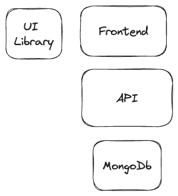

# Prueba técnica Satrack

### Principales funcionalidades
* La aplicación debe permitir crear tareas
* Asignar una categoria
* Establecer una fecha límite

Se crearon dos repositorios para el frontend y el backend:

## Arquitectura seleccionada

Para la aplicación se hicieron las siguientes elecciones en tecnologías para completar la prueba:

* La libreria de UI para el frontend se escogieron tres repositorios, una libreria propia de componentes que habia desarrollado y tenia componentes reusables:
* 
* React-select
* React-DatePicker
* La tecnología escogida para el frontend fue Nextjs con react, css. [repo frontend](https://github.com/camiloamora/satrack-frontend)
* La tecnología escogida para el backend fue :net core versión 7.0, para la organización del proyecto se escogio arquitecturas limpias [repo backend](https://github.com/camiloamora/satrack-backend)
* La tecnología escogida para la base de datos fue mongodb, por la versatilidad en la estructura, y me evitaria un extra en el versionado y actualización de la base de datos.

El demo de la aplicación esta funcionando en esta Url:
[Demo App](https://satrack-app-todo.vercel.app/planning)

## Plataformas de Nube
*   Para el despliegue de la base de datos se eligion mongo atlas por su facilidad de configuración y capa gratuita.
*   Para el frontend se eligio vercel por su facilidad y capa gratuita
*   Para el backend se eligio Azure con app services, por su facilidad de integración con .net y capa gratuita.

